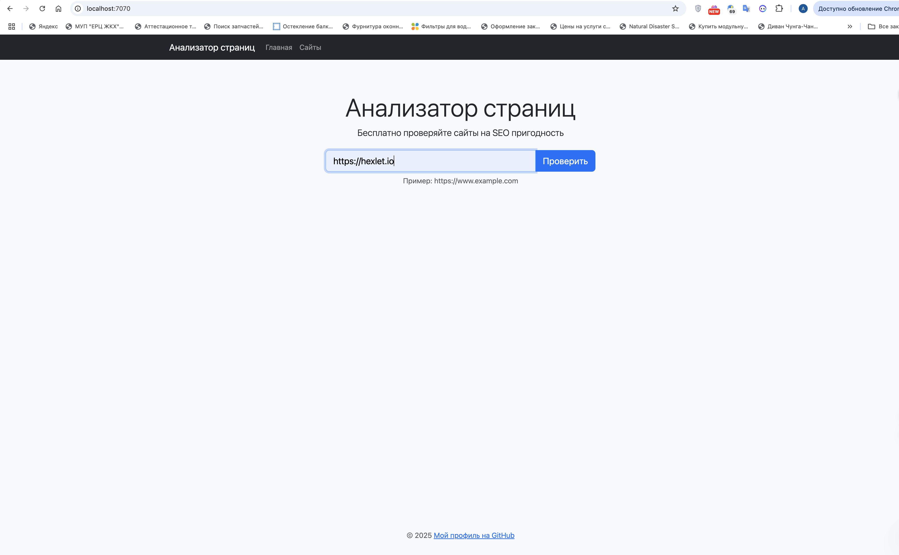
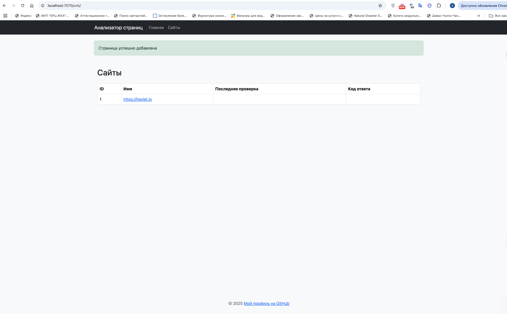

### Hexlet tests and linter status:
[](https://github.com/alexey4050/java-project-72/actions)
[](https://sonarcloud.io/summary/new_code?id=alexey4050_java-project-72)
[](https://github.com/alexey4050/java-project-72/actions/workflows/ci.yml)
[](https://qlty.sh/gh/alexey4050/projects/java-project-72)
[](https://qlty.sh/gh/alexey4050/projects/java-project-72)
[](https://sonarcloud.io/summary/new_code?id=alexey4050_java-project-72)

##  Java project 72

[](https://openjdk.org/projects/jdk/21/)
[](https://gradle.org/)
[](https://javalin.io/)

### :rocket: Демо

Приложение доступно по адресу:

:point_right: [https://java-project-72-a3qj.onrender.com](https://java-project-72-a3qj.onrender.com)

### :package: Зависимости
- Java 21
- Gradle 8.10
- Javalin 6.1.3
- SLF4J 2.0.7

### :hammer_and_wrench: Установка и запуск
#### Локальная сборка
1. Клонируйте репозиторий:
```bash
git clone https://github.com/alexey4050/java-project-72.git
cd java-project-72
```
2. Соберите проект:

```
./gradlew installDist
```
3. Запустите приложение:

```
./build/install/app/bin/app
```
Приложение будет доступно по адресу: (http://localhost:7070)

## Презентация проекта "Анализатор страниц"
### Описание функционала
Проект представляет собой веб-приложение для анализа сайтов на SEO-пригодность. Основные возможности:
#### 1. Главная страница


* Поле для ввода URL сайта для проверки
* Кнопка "Проверить" для запуска анализа
* Пример формата ввода URL

#### 2. Добавление сайта

* После успешного добавления сайта отображается сообщение подтверждения
* Сайт добавляется в общий список с присвоением ID

#### 3. Детальная информация о сайте

* Основная информация о сайте (ID, URL, дата создания)
* Возможность запустить проверку вручную
* Результаты последней проверки:
    * Код ответа сервера
    * Заголовок страницы (Title)
    * Заголовок H1
    * Мета-описание (Description)
    * Дата проверки